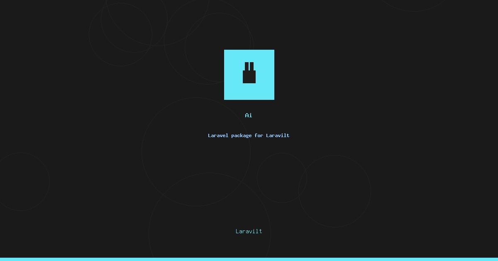

# Laravilt AI

[](https://packagist.org/packages/laravilt/ai)
[](https://packagist.org/packages/laravilt/ai)
[](https://packagist.org/packages/laravilt/ai)

A powerful AI integration package for Laravilt with support for multiple providers (OpenAI, Anthropic, Gemini, DeepSeek), global search spotlight, and chat UI.

## Features

- **Multi-Provider Support**: OpenAI, Anthropic (Claude), Google Gemini, DeepSeek
- **Global Search Spotlight**: Cmd/Ctrl+K spotlight search with AI-powered understanding
- **Chat UI**: Full-featured chat interface with session management
- **Resource AI Agents**: Configure AI capabilities per resource
- **Scout Fallback**: Automatic fallback to Laravel Scout or direct queries when no AI is configured
- **Streaming Support**: Real-time streaming responses

## Installation

```bash
composer require laravilt/ai
```

The package will automatically register its service provider.

## Configuration

Publish the config file:

```bash
php artisan vendor:publish --tag="laravilt-ai-config"
```

Add your API keys to `.env`:

```env
# Default provider
LARAVILT_AI_PROVIDER=openai

# OpenAI Configuration
OPENAI_API_KEY=your-openai-api-key
OPENAI_MODEL=gpt-4o-mini

# Anthropic Configuration
ANTHROPIC_API_KEY=your-anthropic-api-key
ANTHROPIC_MODEL=claude-sonnet-4-20250514

# Google Gemini Configuration
GOOGLE_AI_API_KEY=your-google-api-key
GOOGLE_AI_MODEL=gemini-2.0-flash-exp

# DeepSeek Configuration
DEEPSEEK_API_KEY=your-deepseek-api-key
DEEPSEEK_MODEL=deepseek-chat
```

## Quick Start

### 1. Global Search Component

Add the GlobalSearch component to your layout:

```vue
<script setup>
import { GlobalSearch } from '@laravilt/ai'
</script>

<template>
  <GlobalSearch placeholder="Search..." :use-a-i="true" />
</template>
```

The spotlight search opens with `Cmd/Ctrl+K`.

### 2. AI Chat Component

```vue
<script setup>
import { AIChat } from '@laravilt/ai'
</script>

<template>
  <AIChat :show-sidebar="true" />
</template>
```

### 3. Resource AI Configuration

Add AI capabilities to your resources:

```php
use Laravilt\AI\AIAgent;
use Laravilt\Panel\Resources\Resource;

class ProductResource extends Resource
{
    public static function ai(AIAgent $agent): AIAgent
    {
        return $agent
            ->name('product_assistant')
            ->description('AI assistant for managing products')
            ->searchable(['name', 'description', 'sku'])
            ->canCreate(true)
            ->canUpdate(true)
            ->canDelete(false)
            ->canQuery(true)
            ->systemPrompt('You are a helpful product management assistant.');
    }
}
```

## AI Providers

### OpenAI

```php
use Laravilt\AI\AIManager;

$ai = app(AIManager::class);
$response = $ai->provider('openai')->chat([
    ['role' => 'user', 'content' => 'Hello!'],
]);
```

Available models:
- `gpt-4o` - GPT-4o
- `gpt-4o-mini` - GPT-4o Mini
- `gpt-4-turbo` - GPT-4 Turbo
- `gpt-4` - GPT-4
- `gpt-3.5-turbo` - GPT-3.5 Turbo
- `o1`, `o1-mini`, `o1-preview` - O1 Models

### Anthropic (Claude)

```php
$response = $ai->provider('anthropic')->chat([
    ['role' => 'user', 'content' => 'Hello!'],
]);
```

Available models:
- `claude-sonnet-4-20250514` - Claude Sonnet 4
- `claude-opus-4-20250514` - Claude Opus 4
- `claude-3-5-sonnet-20241022` - Claude 3.5 Sonnet
- `claude-3-5-haiku-20241022` - Claude 3.5 Haiku
- `claude-3-opus-20240229` - Claude 3 Opus

### Google Gemini

```php
$response = $ai->provider('gemini')->chat([
    ['role' => 'user', 'content' => 'Hello!'],
]);
```

Available models:
- `gemini-2.0-flash-exp` - Gemini 2.0 Flash
- `gemini-1.5-pro` - Gemini 1.5 Pro
- `gemini-1.5-flash` - Gemini 1.5 Flash
- `gemini-pro` - Gemini Pro

### DeepSeek

```php
$response = $ai->provider('deepseek')->chat([
    ['role' => 'user', 'content' => 'Hello!'],
]);
```

Available models:
- `deepseek-chat` - DeepSeek Chat
- `deepseek-coder` - DeepSeek Coder
- `deepseek-reasoner` - DeepSeek R1

## Streaming Responses

```php
$ai = app(AIManager::class);
$stream = $ai->provider()->streamChat([
    ['role' => 'user', 'content' => 'Write a story'],
]);

foreach ($stream as $chunk) {
    echo $chunk;
}
```

## Tool Calling

```php
$response = $ai->provider()->chatWithTools(
    messages: [
        ['role' => 'user', 'content' => 'What is the weather in Tokyo?'],
    ],
    tools: [
        [
            'name' => 'get_weather',
            'description' => 'Get weather information for a city',
            'parameters' => [
                'type' => 'object',
                'properties' => [
                    'city' => ['type' => 'string', 'description' => 'City name'],
                ],
                'required' => ['city'],
            ],
        ],
    ]
);

if ($response['tool_calls']) {
    foreach ($response['tool_calls'] as $call) {
        // Handle tool call
        $result = handleToolCall($call['name'], $call['arguments']);
    }
}
```

## Global Search

Register resources for global search:

```php
use Laravilt\AI\GlobalSearch;

app(GlobalSearch::class)
    ->registerResource(
        resource: 'products',
        model: Product::class,
        searchable: ['name', 'description', 'sku'],
        label: 'Products',
        icon: 'Package',
        url: '/admin/products/{id}'
    )
    ->limit(5)
    ->useAI(true);
```

## Vue Composables

### useAI

```typescript
import { useAI } from '@laravilt/ai'

const {
  config,
  loading,
  selectedProvider,
  selectedModel,
  availableProviders,
  availableModels,
  loadConfig,
  chat,
  streamChat,
} = useAI()

// Load configuration
await loadConfig()

// Send a message
const response = await chat([
  { role: 'user', content: 'Hello!' }
])

// Stream a response
for await (const chunk of streamChat(messages)) {
  console.log(chunk)
}
```

### useGlobalSearch

```typescript
import { useGlobalSearch } from '@laravilt/ai'

const {
  query,
  results,
  loading,
  useAI,
  search,
  debouncedSearch,
  clear,
} = useGlobalSearch()

// Perform search
await search('product name')

// Or with debounce
await debouncedSearch('product name', 300)
```

## API Endpoints

The package provides the following API endpoints:

| Method | Endpoint | Description |
|--------|----------|-------------|
| GET | `/laravilt-ai/config` | Get AI configuration |
| POST | `/laravilt-ai/chat` | Send chat message |
| POST | `/laravilt-ai/stream` | Stream chat response |
| GET | `/laravilt-ai/sessions` | List chat sessions |
| POST | `/laravilt-ai/sessions` | Create new session |
| GET | `/laravilt-ai/sessions/{id}` | Get session |
| PATCH | `/laravilt-ai/sessions/{id}` | Update session |
| DELETE | `/laravilt-ai/sessions/{id}` | Delete session |
| GET | `/laravilt-ai/search` | Global search |

## Testing

```bash
composer test
```

## Code Style

```bash
composer format
```

## Static Analysis

```bash
composer analyse
```

## License

The MIT License (MIT). Please see [License File](LICENSE.md) for more information.
